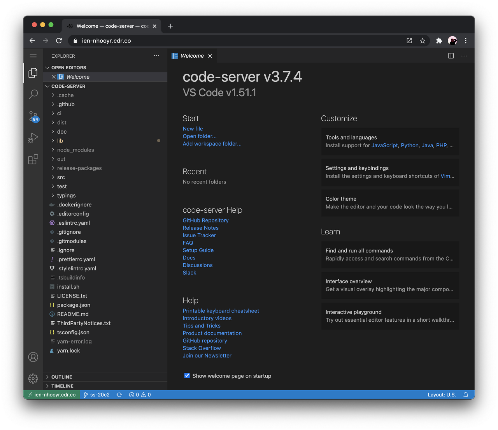

# Code Server

## Code Server - visual studio code server version

서버의 코드를 shell 을 이용하여 vim 이나 emacs와 같은 에디터를 이용하여 접근하는 것도 좋지만 사용 방법에 대한 진입 장벽이 있고 따로 설정을 하지 않으면 코드에 대한 GUI 를 사용하기 어려운 문제가 있습니다. 코드 트리와 git 에 접근 하기 좋고 편집이 용의한 visual studio code 의 서버 버전을 소개합니다. 다만 해당 프로그램은 desktop 버전에 비해 확장 프로그램이 잘 동작하지 않는 문제가 있습니다. 그리고 visual 관련 확장 프로그램 테마를 사용하여 무거워 지면 서버에 무리를 줄 수 있기 때문에 가급적 기본 프로그램을 사용하길 권장합니다.



사용법 : [https://jzi040941.tistory.com/22](https://jzi040941.tistory.com/22)

릴리즈 버전 : [https://github.com/coder/code-server/releases](https://github.com/coder/code-server/releases)

## 사용법

```bash
mkdir ~/utils; cd ~/utils
wget https://github.com/coder/code-server/releases/download/v4.4.0/code-server-4.4.0-linux-amd64.tar.gz
tar xvf code-server-4.4.0-linux-amd64.tar.gz
cd code-server-4.4.0-linux-amd64
./code-server

# edit your configuration files.
# port number, password
vi ~/.config/code-server/config.yaml
```
* config 파일에서 포트와 ip와 비밀번호 등을 수정하여 사용한다