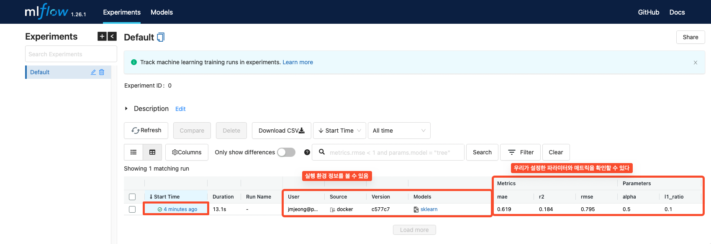
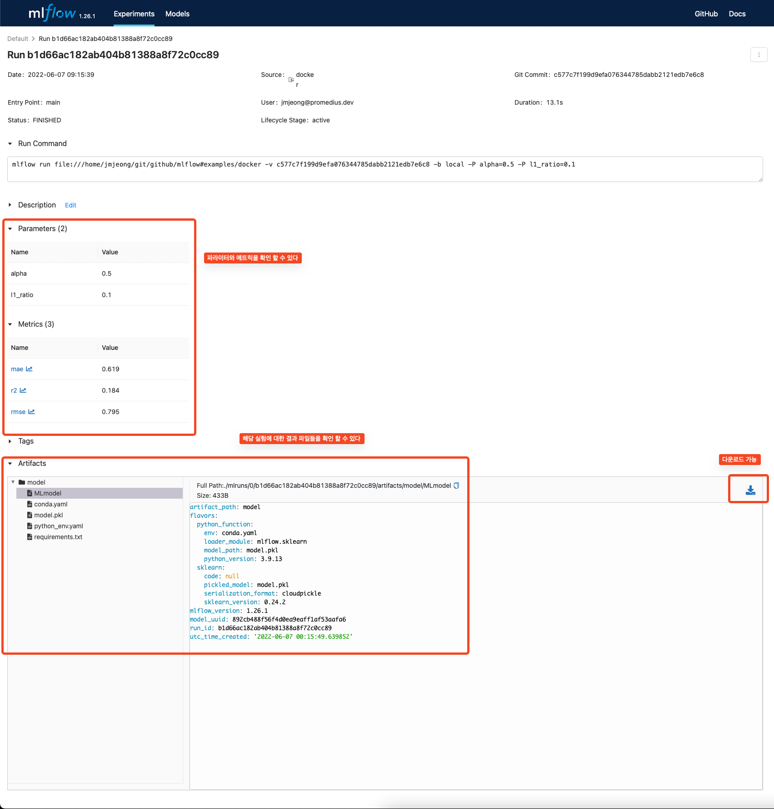
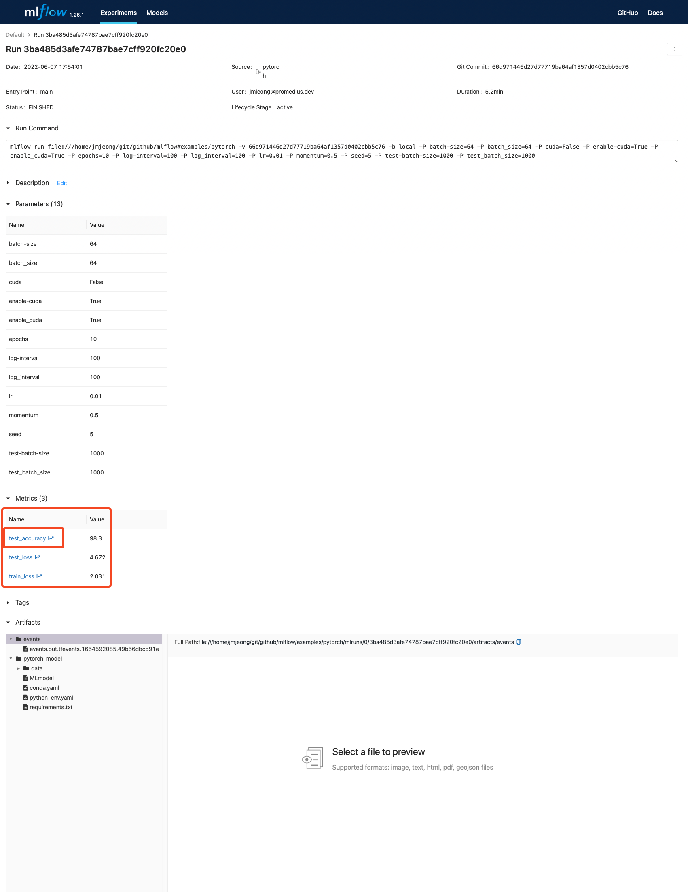
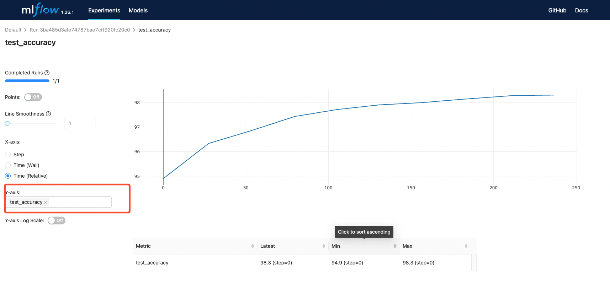
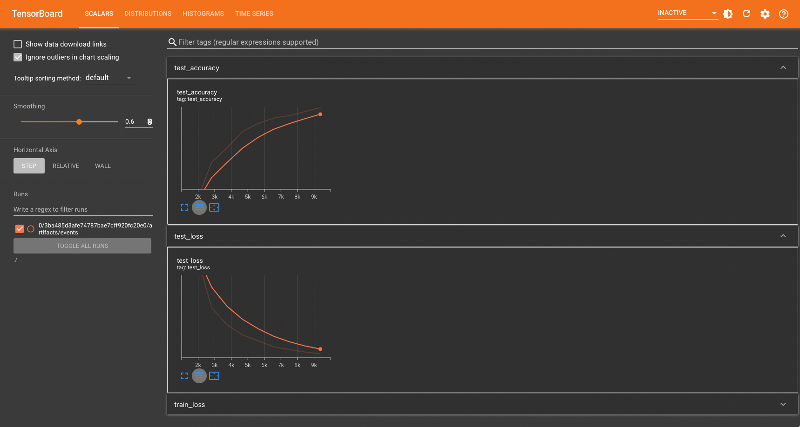

# Mlflow 

## basic usage
- [mlflow](https://github.com/mlflow/mlflow)
- mlflow 저장소의 examples/pytorch/MNIST 와 저장소의 examples/docker를 이용하여 예제를 구성하였습니다
- [mlflow Docs](https://mlflow.org/docs/latest/quickstart.html)

# Mlflow Docker Example
- 도커를 사용한 기본 예제를 분석해 보자

## structure of files
```bash 
$ tree
.
├── Dockerfile
├── kubernetes_config.json
├── kubernetes_job_template.yaml
├── MLproject
├── README.rst
├── train.py
└── wine-quality.csv
```

## Dockerfile
- 평소 사용하는 도커파일과 동일하게 작성하면 되지만 mlflow를 추가로 설치 해주자.
- 도커는 미리 빌드하자 Mlproject 파일의 이미지 이름을 동일하게 만든다
```bash
$ cat Dockerfile
FROM condaforge/miniforge3

RUN pip install mlflow>=1.0 \
    && pip install azure-storage-blob==12.3.0 \
    && pip install numpy==1.21.2 \
    && pip install scipy \
    && pip install pandas==1.3.3 \
    && pip install scikit-learn==0.24.2 \
    && pip install cloudpickle

$ docker build -t mlflow-docker-example .
```

## MLproject
- docer_env 에서 사용할 docker 이름을 설정하자 
```bash
$ cat MLproject
name: docker-example

docker_env:
  image:  mlflow-docker-example

entry_points:
  main:
    parameters:
      alpha: float
      l1_ratio: {type: float, default: 0.1}
    command: "python train.py --alpha {alpha} --l1-ratio {l1_ratio}"

```

## mlflow log
- mlflow 관련 API를 통해서 로그를 활성화 하자. (tensorboard와 사용법이 유사하다)
  - mlflow.log_metric
  - mlflow.log_param
  - mlflow.start_run()
  - mlflow.sklearn.log_model() : 모델 저장
- [원본코드](https://github.com/mlflow/mlflow/blob/master/examples/pytorch/MNIST/mnist_autolog_example.py)
```python

if __name__ == "__main__":
    warnings.filterwarnings("ignore")
    np.random.seed(40)

    parser = argparse.ArgumentParser()
    parser.add_argument("--alpha")
    parser.add_argument("--l1-ratio")
    args = parser.parse_args()

    # Read the wine-quality csv file (make sure you're running this from the root of MLflow!)
    wine_path = os.path.join(os.path.dirname(os.path.abspath(__file__)), "wine-quality.csv")
    data = pd.read_csv(wine_path)

    # Split the data into training and test sets. (0.75, 0.25) split.
    train, test = train_test_split(data)

    # The predicted column is "quality" which is a scalar from [3, 9]
    train_x = train.drop(["quality"], axis=1)
    test_x = test.drop(["quality"], axis=1)
    train_y = train[["quality"]]
    test_y = test[["quality"]]

    alpha = float(args.alpha)
    l1_ratio = float(args.l1_ratio)

    with mlflow.start_run():
        lr = ElasticNet(alpha=alpha, l1_ratio=l1_ratio, random_state=42)
        lr.fit(train_x, train_y)

        predicted_qualities = lr.predict(test_x)

        (rmse, mae, r2) = eval_metrics(test_y, predicted_qualities)

        print("Elasticnet model (alpha=%f, l1_ratio=%f):" % (alpha, l1_ratio))
        print("  RMSE: %s" % rmse)
        print("  MAE: %s" % mae)
        print("  R2: %s" % r2)

        mlflow.log_param("alpha", alpha)
        mlflow.log_param("l1_ratio", l1_ratio)
        mlflow.log_metric("rmse", rmse)
        mlflow.log_metric("r2", r2)
        mlflow.log_metric("mae", mae)

        mlflow.sklearn.log_model(lr, "model")
```

## mlflow env
- 도커를 이용한 mlflow 모듈을 사용하기 위해서는 외부에서 mlflow로 동작을 시켜야 한다
- 관련 환경 설정을 설치해 주자
- 더 좋은 방법은 고민 중에 있다 (to be updated...)
```bash
$ conda create -n mlflow_env python=3.9
$ conda activate mlflow_env
```

## mlflow run
- MLproject에서 설정한 name 을 넣어줘서 실행한다
- 파라미터를 추가로 설정할 수 있다. 추가한 파라미터는 mlflow 로그에 남는다.
```bash
$ mlflow run docker-example -P alpha=0.5
$ mlflow run . -P alpha=0.5
```

## mlflow ui
```bash
$ mlflow ui -p 8811(your port) -h 0.0.0.0
```
- tensorboard와 같이 port와 ip를 설정할수 있다. --help를 참고하자
- 기본은 http://localhost:5000 이다.
- 도커로 동작 시킬 때는 실행은 도커에서 mlflow ui 설정은 conda 에서 해도 좋다 
- 하지만 가장 좋은 것은 실행은 도커에서 mlflow ui나 tensorboard 등 설정은 docker compose를 통해 하면 좋을 듯 하다 (관련 설정은 이후 업데이트 예정)





# Mlflow MNIST
- mlflow와 tensorflow를 모두 사용하는 예제이다
- [원본 : mnist_tensorboard_artifact.py](https://github.com/mlflow/mlflow/blob/master/examples/pytorch/mnist_tensorboard_artifact.py)

## structure of files
- 아나콘다 파일을 사용할 경우 conda.yaml을 이용한다. 다만 아나콘다 사용을 지양하자
- Dockerfile 을 작성한다.
- MLproject 파일에서 실행에 대한 로그를 남길 수 있다.
- MLproject 파일이 있어야 mlflow가 동작한다
```bash 
$ tree
.
├── conda.yaml
├── Dockerfile
├── MLproject
├── mnist_autolog_example.py
└── README.md
```

## Dockerfile
- 평소 사용하는 도커파일과 동일하게 작성하면 되지만 mlflow를 추가로 설치 해주자.
- 도커는 미리 빌드하자 Mlproject 파일의 이미지 이름을 동일하게 만든다
```bash
$ cat Dockerfile
FROM pytorch/pytorch:1.11.0-cuda11.3-cudnn8-runtime

RUN pip install mlflow>=1.0 \
    && pip install torch>=1.9.0 \
    && pip install torchvision>=0.9.1 \
    && pip install tensorboardX \
    && pip install protobuf

$ docker build -t. mnist-tensorboard-docker-example .
```

## MLproject
- docer_env 에서 사용할 docker 이름을 설정하자 
```bash
$ cat MLproject
name: pytorch_tutorial

docker_env:
  image:  mnist-tensorboard-docker-example
  run_params: [['--gpus', '2']]

entry_points:
  main:
    parameters:
      batch-size: {type: int, default: 64}
      test-batch-size: {type: int, default: 1000}
      epochs: {type: int, default: 10}
      lr: {type: float, default: 0.01}
      momentum: {type: float, default: 0.5}
      enable-cuda: {type: string, default: 'True'}
      seed: {type: int, default: 5}
      log-interval: {type: int, default: 100}
    command: |
          python mnist_tensorboard_artifact.py \
            --batch-size {batch-size} \
            --test-batch-size {test-batch-size} \
            --epochs {epochs} \
            --lr {lr} \
            --momentum {momentum} \
            --enable-cuda {enable-cuda} \
            --seed {seed} \
            --log-interval {log-interval}
```

## mlflow log
- mlflow 관련 API를 통해서 로그를 활성화 하자. (tensorboard와 사용법이 유사하다)
  - mlflow.log_metric
  - mlflow.start_run()
  - mlflow.pytorch.log_model() : 모델 저장
- [원본코드](https://github.com/mlflow/mlflow/blob/master/examples/pytorch/mnist_tensorboard_artifact.py)
```python
def log_scalar(name, value, step):
    """Log a scalar value to both MLflow and TensorBoard"""
    writer.add_scalar(name, value, step)
    mlflow.log_metric(name, value)

with mlflow.start_run():
    # Log our parameters into mlflow
    for key, value in vars(args).items():
        mlflow.log_param(key, value)

    # Create a SummaryWriter to write TensorBoard events locally
    output_dir = dirpath = tempfile.mkdtemp()
    writer = SummaryWriter(output_dir)
    print("Writing TensorBoard events locally to %s\n" % output_dir)

    # Perform the training
    for epoch in range(1, args.epochs + 1):
        train(epoch)
        test(epoch)

    # Upload the TensorBoard event logs as a run artifact
    print("Uploading TensorBoard events as a run artifact...")
    mlflow.log_artifacts(output_dir, artifact_path="events")
    print(
        "\nLaunch TensorBoard with:\n\ntensorboard --logdir=%s"
        % os.path.join(mlflow.get_artifact_uri(), "events")
    )

    # Log the model as an artifact of the MLflow run.
    print("\nLogging the trained model as a run artifact...")
    mlflow.pytorch.log_model(model, artifact_path="pytorch-model", pickle_module=pickle)
    print(
        "\nThe model is logged at:\n%s" % os.path.join(mlflow.get_artifact_uri(), "pytorch-model")
    )

    # Since the model was logged as an artifact, it can be loaded to make predictions
    loaded_model = mlflow.pytorch.load_model(mlflow.get_artifact_uri("pytorch-model"))

    # Extract a few examples from the test dataset to evaluate on
    eval_data, eval_labels = next(iter(test_loader))

    # Make a few predictions
    predictions = loaded_model(eval_data).data.max(1)[1]
    template = 'Sample {} : Ground truth is "{}", model prediction is "{}"'
    print("\nSample predictions")
    for index in range(5):
        print(template.format(index, eval_labels[index], predictions[index]))
```

- autolog를 이용할 수도 있지만 지양하자
- 우리는 구제적인 파라미터와 메트릭에 관한 정보를 알고 싶다
```python
mlflow.pytorch.autolog()
```

## mlflow env
- 도커를 이용한 mlflow 모듈을 사용하기 위해서는 외부에서 mlflow로 동작을 시켜야 한다
- 관련 환경 설정을 설치해 주자
- 더 좋은 방법은 고민 중에 있다 (to be updated...)
```bash
$ conda create -n mlflow_env python=3.9
$ conda activate mlflow_env
$ pip install mlflow tensorboard
```

## mlflow run
- MLproject에서 설정한 name 을 넣어줘서 실행한다
- 파라미터를 추가로 설정할 수 있다. 추가한 파라미터는 mlflow 로그에 남는다.
```bash
$ mlflow run .
$ mlflow run mnist-tensorboard-docker-example
```

## mlflow ui
```bash
$ mlflow ui -p 8811(your port) -h 0.0.0.0
$ tensorboard --logdir ./mlruns --host 0.0.0.0 --port 8833(your port) 
```
- tensorboard와 같이 port와 ip를 설정할수 있다. --help를 참고하자
- 기본은 http://localhost:5000 이다.
- 도커로 동작 시킬 때는 실행은 도커에서 mlflow ui 설정은 conda 에서 해도 좋다 
- 하지만 가장 좋은 것은 실행은 도커에서 mlflow ui나 tensorboard 등 설정은 docker compose를 통해 하면 좋을 듯 하다 (관련 설정은 이후 업데이트 예정)






## mlflow serving
- 학습 후 모델의 서빙을 바로 해 볼 수 있다.
- test 케이스를 만들기에 좋다.
```bash 
$ mlflow models serve -m runs:/<RUN_ID>/model
```

## save model 
- [model-registry](https://mlflow.org/docs/latest/model-registry.html#registry)

# Kubernetes Setting
- [샘플](https://github.com/mlflow/mlflow/tree/master/examples/docker)
- to be updated .. 