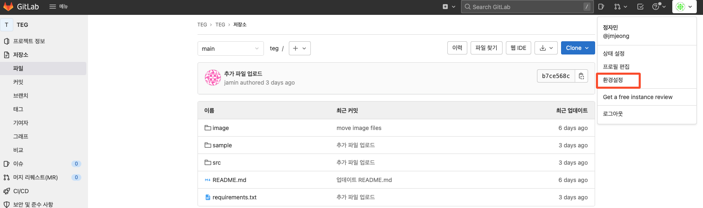
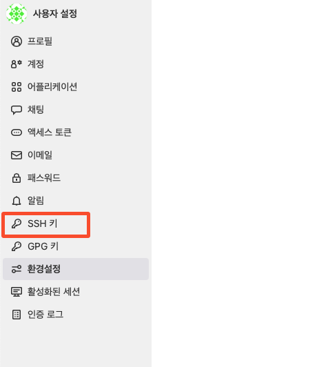
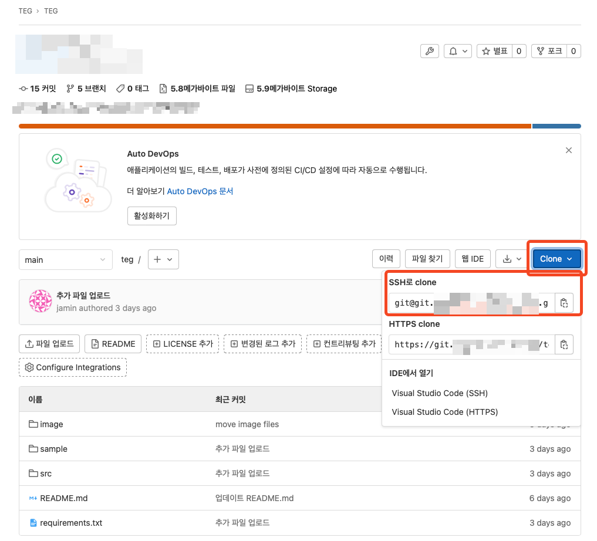

## ssh key 생성
- [shell 기본](https://git.testdns.dev/documents/home/-/wikis/shell%20bash%20기준) 참고
```bash
$ ssh-keygen
Generating public/private rsa key pair.
Enter file in which to save the key (/home/jmjeong/.ssh/id_rsa): 
Created directory '/home/jmjeong/.ssh'.
Enter passphrase (empty for no passphrase): 
Enter same passphrase again: 
Your identification has been saved in /home/jmjeong/.ssh/id_rsa
Your public key has been saved in /home/jmjeong/.ssh/id_rsa.pub
The key fingerprint is:
SHA256:dddd????????KKKKKKKKKKKKKKKKK jmjeong@testdns.dev@pathfinder
The key's randomart image is:
+---[RSA 3072]----+
| .Xo..           |
| o.B..           |
| +. + .          |
|=. . + + .       |
|+ + * + S        |
| * X = o         |
|E * * o          |
|=% o o           |
|B.o              |
+----[SHA256]-----+

$cat ~/.ssh/id_rsa.pub
... 내용 복사 ...
```

## gitlab 등록







- 이제 ssh로 clone이 가능해 진다. git pull, push 할 때 아이디, 비번 입력이 필요 없다