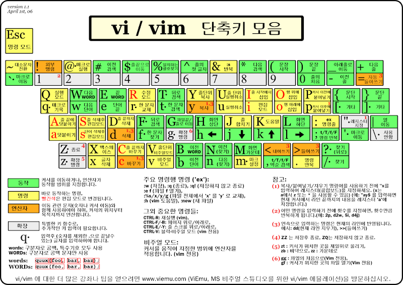

# 목차
- [Why](#why)
- [Keyboard Shortcut](#keyboard-shortcut)
- [useful tips](#useful-tips)
  * [cursor move](#cursor-move)
  * [Edit mode](#edit-mode)
  * [block mode](#block-mode)
    + [select block mode](#select-block-mode)
    + [action after selecting block](#action-after-selecting-block)
  * [file mode](#file-mode)

<small><i><a href='http://ecotrust-canada.github.io/markdown-toc/'>Table of contents generated with markdown-toc</a></i></small>

# Why
- 우리는 결국 리눅스 시스템을 이용하게 되면 터미널에서 쉽게 사용할 수 있는 에디터를 배워야 하는 시점이 오게 된다. 
- 여기서는 그 대표적인 예인 vim과 친숙해 져 보자 
  - 예) emacs, nano 등이 있다

# Keyboard Shortcut

- 자세한 팁은 [여기](https://www.joinc.co.kr/w/Site/Vim/Documents/UsedVim)
- 어쩔 수 없이 이 그림을 자주 보는게 익숙해 지는 길이다.

# useful tips
- 기본적인 사용법은 다른 분들이 사용하면서 여기 추가해 주리라 믿겠다
- 이건 정말 유용했다 싶은 것들을 적어본다.

## cursor move
| command | 역활 |
| ------ | ------ | 
| k       | 커서를 위로 움직임                                       |
| j       | 커서를 아래로 움직임                                      |
| h       | 커서를 왼쪽으로 움직임                                     |
| l       | 커서를 오른쪽으로 움직임                                    |
| -       | 커서를 줄의 처음으로 옮김                                   |
| e, E    | 다음단어의 끝으로, 문자단위 이동                               |
| w, W    | 다음단어의 처음으로, 문자단위 이동                              |
| $       | 줄의 마지막으로                                         |
| 0       | 줄의 처음으로                                          |
| ^       | 줄의 처음으로(공백이 아닌 처음시작되는 문자)                        |
| Shift+g | 문서의 마지막으로 이동한다.                                  |
| gg, 1g  | 문서의 처음으로 이동한다. 1대신 다른 숫자를 입력하면 해당 숫자의 라인으로 이동한다. |
| ), (    | 다음, 이전 문장의 처음으로                                  |
| }, {    | 다음, 이전문단의 처음으로                                   |
| ]], [[  | 다음, 이전 구절의 처음으로                                  |

## Edit mode
| command | 역활 |
| ------ | ------ | 
| y           | 한줄 복사                                 |
| yn          | 현재 라인에서부터 n라인만큼을 복사                   |
| p           | 복사된 내용 붙이기                            |
| dd          | 한줄삭제                                  |
| dw          | 한단어 삭제                                |
| Shift+d, d$ | 현재커서 위치에서 마지막까지 삭제                    |
| Shift+j     | 현재 행의 개행문자를 제거한다. 즉 아래라인을 현재라인에 덧붙인다. |

## block mode
### select block mode

| command | 역활 |
| ------ | ------ | 
| v       | 단어단위로 블럭지정이 가능하다. 블럭범위는 이동명령인 'hjkl' 로 원하는 범위 만큼 지정할수 있다.    |
| Shift+v | 라인단위 블럭지정이다. 라인전체가 선택되며, 위아래 이동명령 'hj' 으로 범위 지정이 가능하다.       |
| Ctrl+v  | 블럭단위 블럭지정이다. 4각형의 블럭지정이 가능하며 이동명령인 'hjkl' 로 원하는 범위를 지정할수 있다. |

### action after selecting block
| command | 역활 |
| ------ | ------ | 
| y  | 지정된 블럭을 복사한다.             |
| p  | 복사된 블럭을 현재라인(커서) 아래에 붙인다. |
| d  | 지정된 블럭을 삭제한다.             |
| dd | 현재라인을 삭제한다.               |

## file mode
- 편집 창 간의 이동은 ctrl + w, w (ctrl을 누르고 w를 두번 누르면 된다)

| command | 역활 | 예시 |
| ------ | ------ | ------ |
| :e | 파일 열기 | :e ./test.py or ./e ./폴더 |
| :sp | 가로 파일 열기 or 현재 파일 분할 | :sp ./test.py or :sp or :sp ./폴더 |
| :vs | 세로 파일 열기 or 현재 파일 분할 | :vs ./test.py or :vs or :vs ./폴더 |
| :w | 파일 저장 | :w or :w ./file.py |
| :q | 나가기 | :q |
| :wq | 저장 후 나가기 | :wq |
| :q! | 저장 안하고 나가기 | :q! |
| :wa | 열은 파일 모두 저장 | :wa |
| :wqa | 열은 파일 모두 저장 후 나가기 | :wqa |
| :qa | 열은 파일 모두 나가기 | :qa |
| :qa! | 열은 파일 모두 저장 안하고 나가기 | :qa! |
