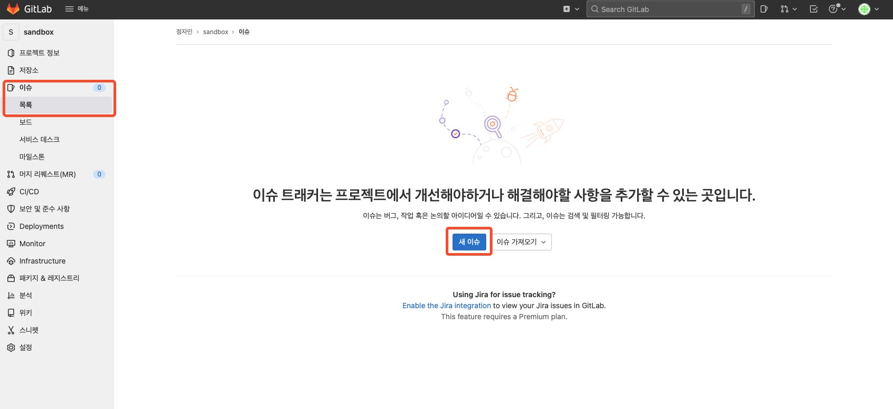
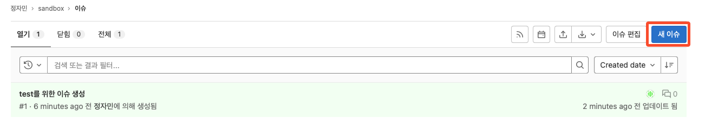
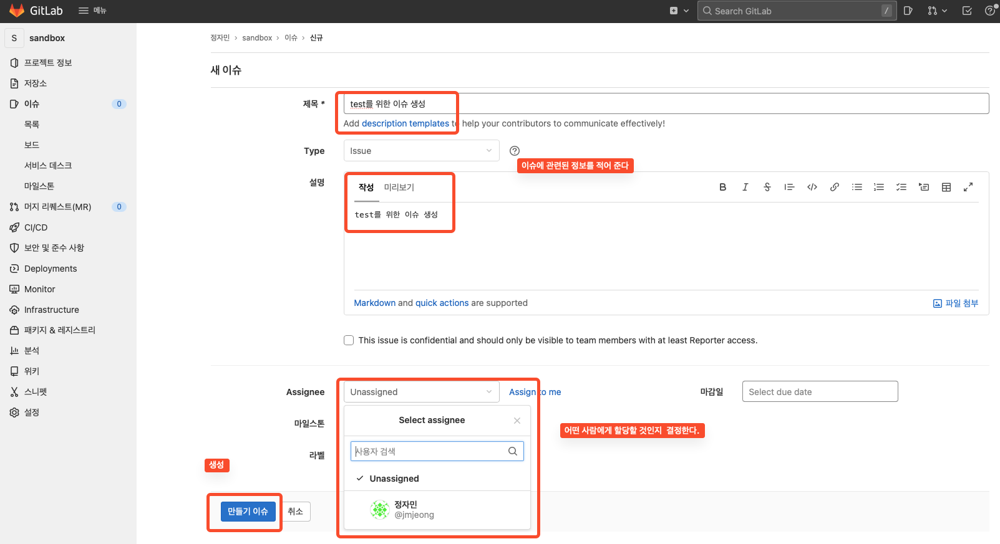
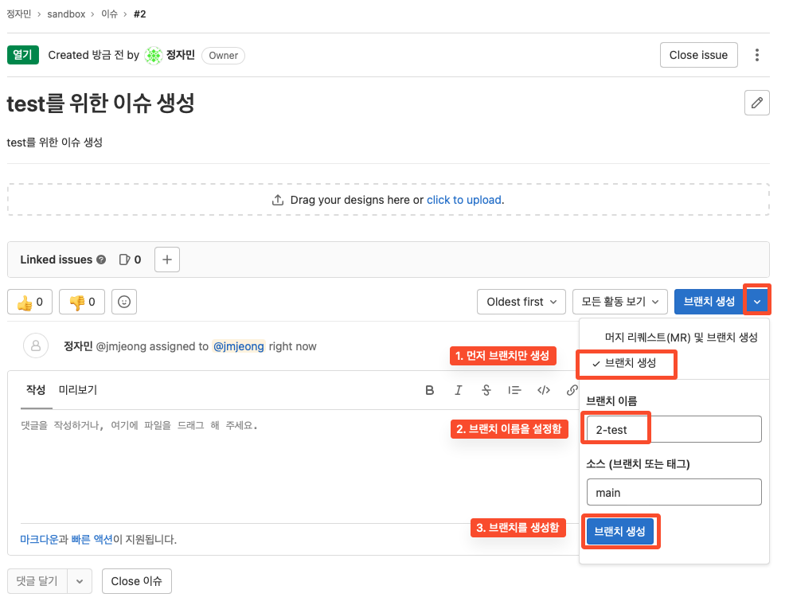
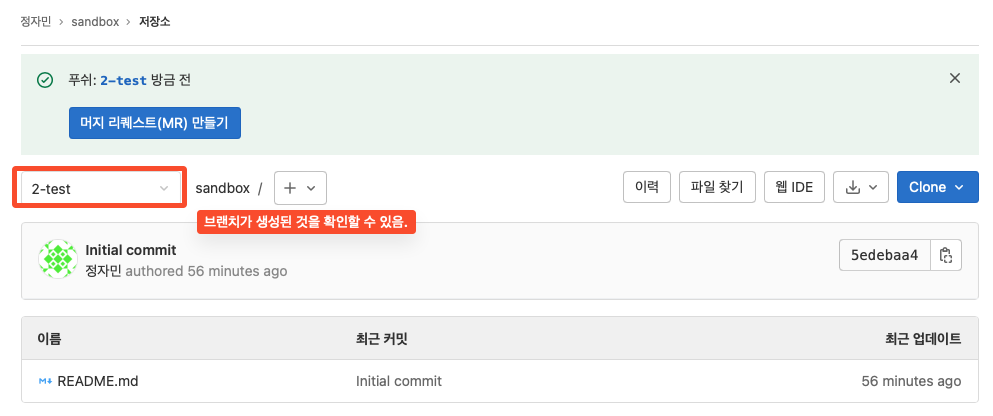
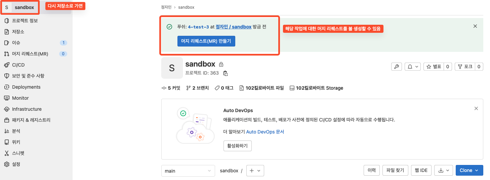
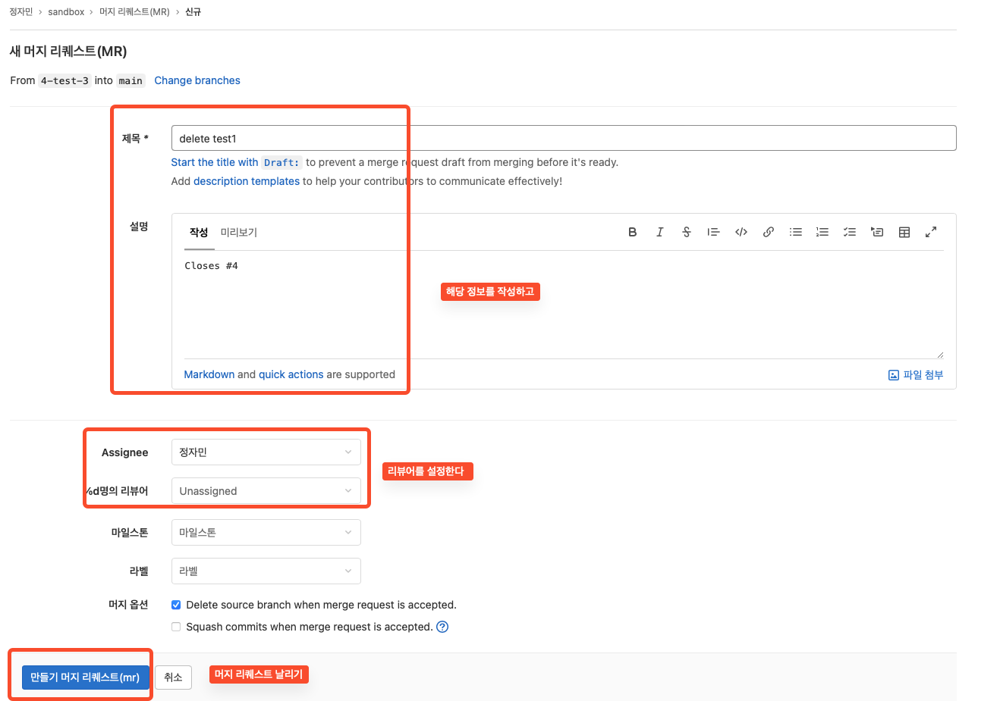
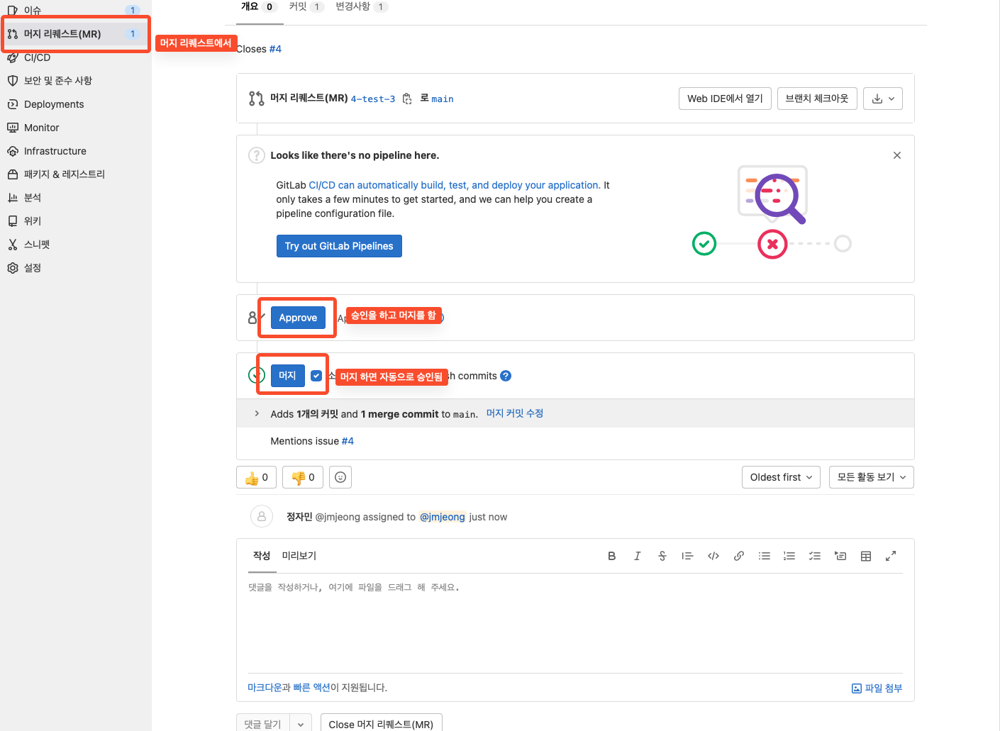
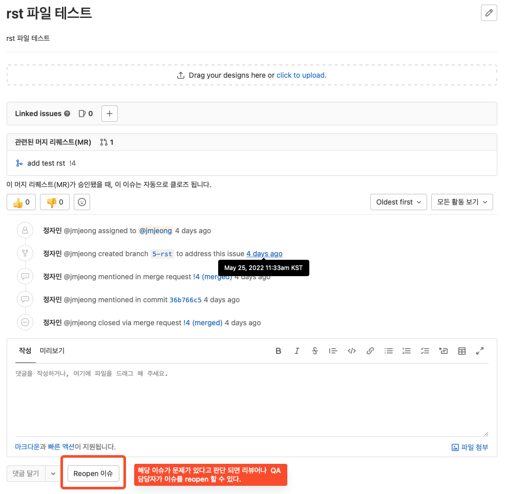

# new issue
- 처음 이슈를 생성하는 경우



- 기존의 이슈가 있고 새로 생성하는 경우



# create new branch
- 새로운 브랜치 생성

- 생성된 이슈에 대해 관련 제목과 설명을 달아 주고 누구에서 할당할 것인지 결정하자 
  - 자신에게도 할당할 수 있다



- 바로 머지 리퀘스트를 만들지 말고 브랜치부터 생성하자



- 새로운 브랜치가 생성된 것을 확인할 수 있다.



# checkout new branch
- 해당 저장소를 클론을 받지 않았다면 클론을 받고 이미 클론을 받았다면 새로 pull을 받자
- 새로운 브랜치가 생성된 것을 확인 할수 있다
```bash
$ git pull
From git.testdns.dev:jmjeong/sandbox
 * [new branch]      2-test     -> origin/2-test
Already up to date.
```
- 새로운 브랜치로 이동하자 
```bash
$ git checkout 2-test
Branch '2-test' set up to track remote branch '2-test' from 'origin'.
Switched to a new branch '2-test'
```

# resolve issues.
- commit은 하나만 만들 필요는 없다. 수정한 일의 단위 별로 commit을 만들자.
- 해당 이슈를 해결 하기까지 테스트를 거쳐 확인을 한뒤 머지 리퀘스트를 날리자.

```bash
$ echo "test" > test.txt
$ git status                                                                                                                                               On branch 2-test
Your branch is up to date with 'origin/2-test'.

Untracked files:
  (use "git add <file>..." to include in what will be committed)
	test.txt

nothing added to commit but untracked files present (use "git add" to track)
$ git add ./test.txt
$ git commit -m "modified test.txt" 
[2-test d40a913] modified test.txt
 1 file changed, 1 insertion(+)
 create mode 100644 test.txt
$ git push
Enumerating objects: 4, done.
Counting objects: 100% (4/4), done.
Delta compression using up to 12 threads
Compressing objects: 100% (2/2), done.
Writing objects: 100% (3/3), 281 bytes | 281.00 KiB/s, done.
Total 3 (delta 0), reused 0 (delta 0), pack-reused 0
remote: 
remote: To create a merge request for 2-test, visit:
remote:   https://git.testdns.dev/jmjeong/sandbox/-/merge_requests/new?merge_request%5Bsource_branch%5D=2-test
remote: 
To git.testdns.dev:jmjeong/sandbox.git
   5edebaa..d40a913  2-test -> 2-test
```

# merge request
- 다시 저장소로 돌아 오면 push한 브랜치로 머지 리퀘스트를 만들자고 팝업이 뜬다



- 관련 이슈를 정리하고 
- 머지 리퀘스트 담당자를 할당하고 리뷰어를 할당하자
- 그리고 머지 리퀘스트를 날리자



- 리뷰어와 담당자가 코드 리뷰를 진행하고 이슈가 충분히 해결 됬다고 판단되면 master(main) 브랜치에 머지 버튼을 눌러 머지 해 주자 
- 승인 후 머지를 해 줘도 되고 
- 머지 해주면 자동으로 승인이 되며 이슈가 닫히고 브랜치도 없어진다.
- 이슈가 닫히지 않았다면 정상적인 동작이 아닐 수 있다
- 다만 이슈가 아직 해결 되지 않았다고 판단되면 아래 댓글 기능을 통해 충분히 소통하여 문제를 해결하자



# reopen issue
- 이슈가 아직 문제가 있다고 판단될 경우 QA 담당자를 포함한 저장소에 포함된 누구나 issue를 reopen 할 수 있다.



# remove local branch
- 마지막으로 로컬에서 다시 main 브랜치로 이동하자 
```bash
$ git checkout main
```
- 필요에 따라 이슈의 로컬 브랜치가 삭제 되지 않았다면 삭제해도 좋다

```bash
$ git branch -a
  2-test
* main
$ git branch -D 2-test
```
